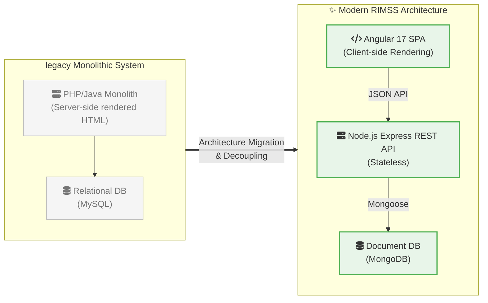
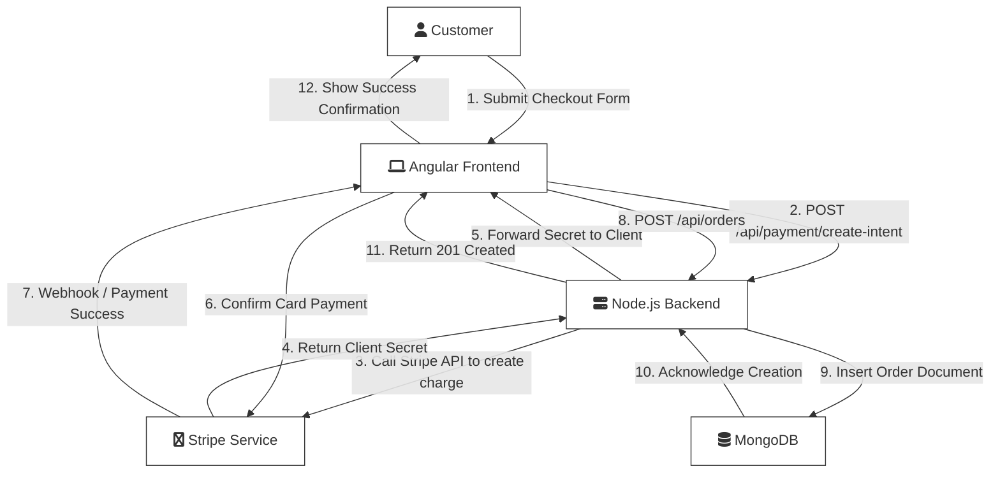
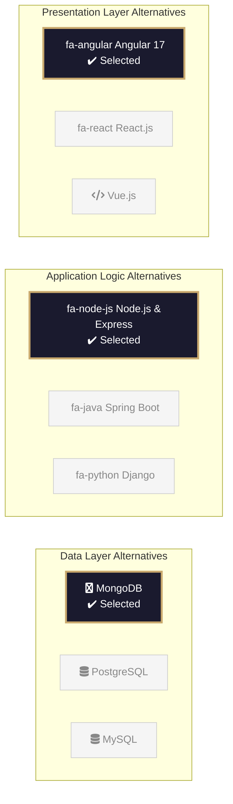

# RIMSS Solution Architecture Diagrams

Based on the reference style and the requested diagram types, here are the architectural models for the RIMSS project.

## 1. Compact Solution Diagram
**Expressing entire solution idea in one compact diagram using icons.**
This groups the components by environments (Client, Server, External) and shows the communication protocols.

```mermaid
flowchart TD
    %% Web Client Environment
    subgraph ClientEnv ["🌐 Web Client Environment"]
        Desktop["fa:fa-desktop Desktop Browser<br/>(Chrome, Safari, Edge)"]
        Mobile["fa:fa-mobile Mobile Browser<br/>(iOS, Android)"]
    end

    %% Server Environment
    subgraph ServerEnv ["☁️ Server Environment"]
        direction LR
        AppServer["fa:fa-server Node.js Web/App Server<br/>(Express API)"]
        MongoDB["fa:fa-database Document Database<br/>(MongoDB)"]
        
        AppServer <-->|TCP / Mongoose| MongoDB
    end
    
    %% External Entities
    subgraph External ["🔌 External Entities"]
        Stripe["fa:fa-credit-card Payment Gateway<br/>(Stripe)"]
    end

    %% Connections
    Desktop <-->|Internet (HTTP/HTTPS)<br/>JSON| AppServer
    Mobile <-->|Internet (HTTP/HTTPS)<br/>JSON| AppServer
    AppServer <-->|Internet (HTTPS)<br/>JSON/XML| Stripe
    
    %% Styling based on the reference image
    classDef envBox fill:#f9f9f9,stroke:#999,stroke-dasharray: 5 5;
    class ClientEnv,ServerEnv,External envBox;
    
    classDef nodeBox fill:#e3f2fd,stroke:#64b5f6,stroke-width:1px;
    class Desktop,Mobile nodeBox;
    
    classDef serverBox fill:#bbdefb,stroke:#2196f3,stroke-width:2px;
    class AppServer serverBox;
    
    classDef dbBox fill:#dcedc8,stroke:#8bc34a,stroke-width:1px;
    class MongoDB dbBox;
    
    classDef extBox fill:#ffe0b2,stroke:#ff9800,stroke-width:1px;
    class Stripe extBox;
```

## 2. Transition Diagram
**Showing the transition from an old/legacy system to the new system.**
This illustrates moving from a traditional monolith tightly coupled to a SQL database, toward a decoupled SPA and REST API with a NoSQL database.



## 3. Data Flow Diagram
**Diagram having arrows tagged with sequence numbers to show flow of data.**
This demonstrates the payment checkout and order placement flow in RIMSS.



## 4. System Model (Alternative Technologies)
**Showing alternative technology options for the DAR Document.**
This outlines the choices evaluated for each tier of the stack, highlighting the final choices made for RIMSS.


