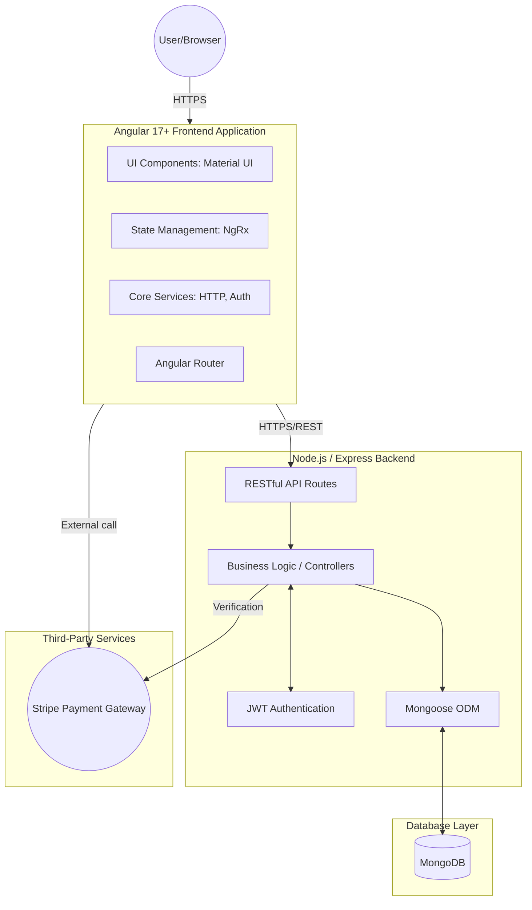

# Solution Approach Document: RIMSS E-Commerce Platform

## 1. Technical Diagram

## 2. Solution Architecture

The RIMSS application follows a standard **Three-Tier Architecture** utilizing the MEAN/MERN stack conventions (MongoDB, Express, Angular, Node.js).

**Presentation Tier (Frontend):**
- Built with **Angular 17+** as a standalone component application.
- Uses **Angular Material** for a responsive, accessible, and fast UI component library.
- **NgRx** is utilized for robust, predictable state management (e.g., Cart state, User Session).
- Component architecture is modularized by features (Catalog, Checkout, Profile, Look Book).

**Application Tier (Backend):**
- A **Node.js** runtime using the **Express.js** framework provides RESTful APIs to the frontend.
- Controllers handle business logic such as cart validations, order processing, and user authentication.
- **JWT (JSON Web Tokens)** are used to authenticate and authorize API requests securely.

**Data Tier (Database):**
- **MongoDB** is used as the primary NoSQL document store, providing flexibility for product catalog structures (categories, variants, look books).
- **Mongoose ODM** is used to enforce schema validation and provide a straightforward mapping between business objects and the database.

**Integrations:**
- **Stripe** is used for secure payment processing during the checkout flow via Stripe Payment Intents, allowing PCI-compliant transactions.

## 3. Non-Functional Requirements Coverage

| Requirement | Implementation Strategy |
| :--- | :--- |
| **Security** | - **Authentication:** JWT for protecting private routes and user data. - **Transport:** All data (frontend to backend) must be served over HTTPS/TLS. - **Data Protection:** Passwords securely hashed (e.g., bcrypt) before saving to the database. Stripe handles raw credit card data, offloading PCI compliance. |
| **Scalability** | - **Horizontal Scaling:** The backend Express application is stateless (session state held in JWT token and DB), allowing it to be easily scaled horizontally via load balancers (e.g., Kubernetes or AWS ECS/Fargate). - **Database Scaling:** MongoDB provides native sharding for when data size or throughput increases. |
| **Reliability** | - Comprehensive error handling on the backend with appropriate HTTP status codes. - On the frontend, Interceptors catch global errors and display user-friendly snackbar messages. |
| **Maintainability** | - Adherence to strict TypeScript interfaces and generic types across the stack. - Feature-based folder structure in Angular, improving module decoupling. |
| **Accessibility** | - Angular Material components natively comply with ARIA (Accessible Rich Internet Applications) standards. |

## 4. Performance

- **Lazy Loading:** The Angular router uses lazy loading for feature modules (e.g., separating the Catalog from User Profile and Checkout). This reduces the initial JavaScript bundle size, speeding up the Time-to-Interactive (TTI).
- **State Management Caching:** Using NgRx allows the application to cache data locally. For instance, cart items and user profiles do not need constant refetching.
- **Image Optimization:** Product images and Look Book galleries should be served via a CDN (Content Delivery Network). Responsive images (`srcset`) will be utilized to serve appropriate sizes based on the user's device.
- **Database Indexing:** Frequently queried fields in MongoDB (such as `productId`, `SKU`, and user `email`) will be indexed for fast read operations.
- **API Response Times:** The backend is designed to return payload sizes restricted to necessary fields, avoiding over-fetching.

## 5. Assumptions & Scope

**In Scope:**
- Full user journey from browsing the product catalog to completing a checkout.
- User profile management, including an address book (multiple shipping addresses).
- Integration with a mocked or test-mode payment gateway (Stripe).
- A "Look Book" feature for curated collections.
- Administrator capabilities (basic seeding of product data).
- Core REST API development and MongoDB schema definitions.

**Out of Scope:**
- Live integration with a real payment gateway or physical fulfillment/shipping providers (e.g., FedEx, UPS).
- Complex inventory management (e.g., warehouse bin tracking).
- Real-time chat support or AI-based product recommendations.
- Multi-tenant architecture (this is a single storefront site).

**Assumptions:**
- The target audience primarily uses modern web browsers (Chrome, Edge, Firefox, Safari); legacy browsers (e.g., IE11) are not supported.
- The system expects moderate traffic initially but is architected to be cloud-ready (AWS/GCP/Azure) for future scaling.
- Product images will be hosted and provided via external URLs in the current implementation iteration.
